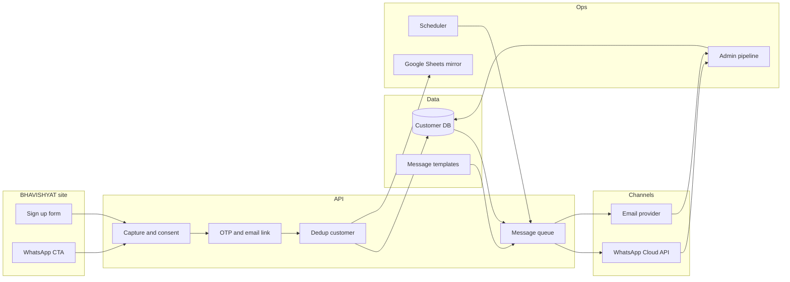
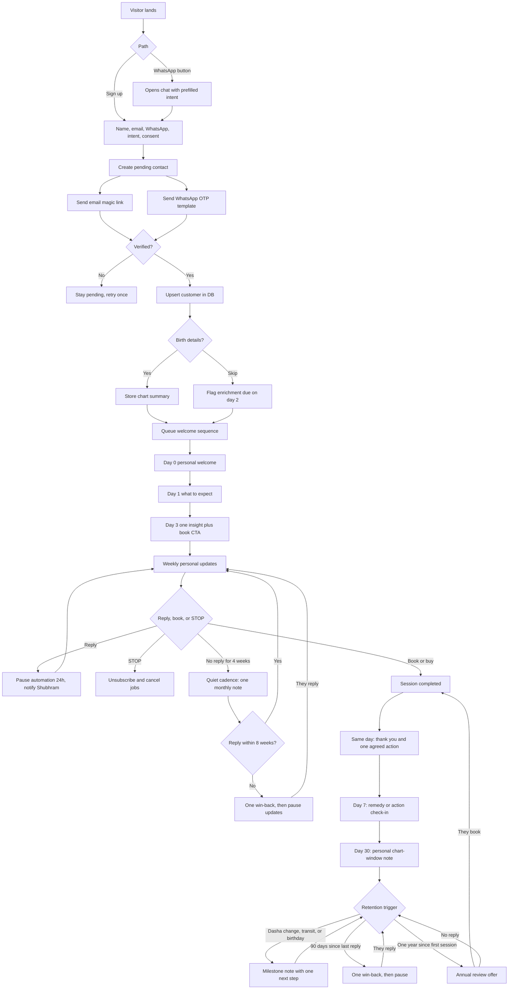

# BHAVISHYAT — Customer Funnel Pipeline

New visitors sign up, confirm WhatsApp and email, land in the customer database, and then receive regular personal updates. Paid consultation is the conversion goal. Birth details make those updates specific to the person.

Today the site opens WhatsApp (`wa.me`) and logs the click to Google Sheets. Sign up in the header is still a placeholder. Sheets stay as a reporting mirror. The customer database is the source of truth.

## Goals

- Capture name, email, and WhatsApp number with explicit consent.
- Store one customer record, even if they arrive from the site, WhatsApp, or a kundali request.
- After the record is saved, start a welcome sequence and then a recurring personal update cadence.
- Keep messages personal (name, moon sign, current dasha, next window) and stoppable.

## Funnel stages

| Stage | What happens | Exit condition |
| --- | --- | --- |
| 1. Discover | SEO, YouTube, retreats, remedies, or a shared kundali page | Visitor opens sign up or WhatsApp |
| 2. Capture | Sign up form: name, email, WhatsApp, intent, consent | Form submitted |
| 3. Verify | Email link and WhatsApp OTP | Both channels confirmed, or one channel confirmed and the other marked pending |
| 4. Enrich | Optional birth details (date, time, place) for personal updates | Saved, or skipped and reminded later |
| 5. Persist | Deduped customer row written; welcome jobs queued | `customers.status = active` |
| 6. Welcome | Day 0 / 1 / 3 personal messages on the channels they opted into | Welcome sequence complete |
| 7. Nurture | Weekly or dasha-timed personal updates | They book, go quiet, pause, or opt out |
| 8. Convert | Consultation slot, kundali order, or retreat enquiry | Paid or booked |
| 9. Retain | Post-session follow-up, milestone notes, and a slower cadence when they go quiet | They stay active, pause, or unsubscribe |

## Optimized steps to include from the start

1. **Consent before any outbound message.** Store channel, timestamp, and the exact text they agreed to. WhatsApp outbound after the 24-hour chat window must use an approved template. Email needs a one-click unsubscribe.
2. **Verify the number and the inbox.** OTP on WhatsApp and a magic link on email. Unverified contacts stay in `pending` and never enter the update schedule.
3. **One person, one record.** Match on WhatsApp number first, then email. A second visit updates the same row and logs a new touch, instead of creating a duplicate.
4. **Intent on the form.** Ask what they want: kundali, consultation, class, retreat, or updates only. This picks the first message and the offer, not a generic blast.
5. **Birth details are enrichment, not a wall.** They can finish sign up without them. A reminder on day 2 asks for date, time, and place so later messages can name their dasha and transits.
6. **Frequency cap and quiet hours.** Default: one personal update a week, plus time-critical dasha windows. Send between 9:00 and 20:00 IST. Never two channels with the same text on the same day — WhatsApp carries the short note, email carries the longer reading.
7. **Personal, not broadcast.** Each job renders from the customer row: first name, moon sign, running dasha, next favourable window, and one clear next step (reply, book, or open the chart).
8. **Stop words and preferences.** `STOP` on WhatsApp and the email unsubscribe link set `status = unsubscribed` immediately and cancel queued jobs.
9. **Human handoff.** A reply on WhatsApp pauses automation for 24 hours and notifies Shubhram, so a live conversation is not interrupted by a scheduled note.
10. **Sheets as a mirror only.** After insert, append a row for reporting. The app never reads Sheets to decide who gets a message.

## Architecture

## Sign-up to first personal update

## Customer record

Minimum fields:

| Field | Purpose |
| --- | --- |
| `id` | Primary key |
| `name` | Greeting |
| `email` | Email channel |
| `whatsapp_e164` | WhatsApp channel, dedup key |
| `email_verified_at` | Gate for email jobs |
| `whatsapp_verified_at` | Gate for WhatsApp jobs |
| `consent_email` / `consent_whatsapp` | Legal record |
| `consent_at` / `consent_text` | What they agreed to |
| `intent` | kundali, consultation, class, retreat, updates |
| `birth_date`, `birth_time`, `birth_place` | Personalization |
| `chart_summary` | Moon, lagna, running dasha — computed once, refreshed on dasha change |
| `status` | pending, active, paused, unsubscribed |
| `stage` | discover, captured, verified, nurturing, converted, retained |
| `cadence` | weekly, monthly, milestone |
| `last_reply_at` | Silence clock for quiet and win-back |
| `last_session_at` | Starts the post-session retention clock |
| `next_message_at` | Scheduler pointer |
| `source` | page URL or CTA name |

Related tables: `message_jobs` (channel, template, send_at, status), `message_events` (sent, delivered, read, replied, bounced, opted_out), `touches` (each visit or CTA click).

## Message cadence after the DB insert

| When | Channel | Content |
| --- | --- | --- |
| Immediate | Email + WhatsApp | Welcome by name, confirm they will get personal updates, how to stop |
| Day 1 | Email | How readings work, one expectation, link to book a slot |
| Day 2 | WhatsApp | Ask for birth details if missing |
| Day 3 | WhatsApp | One chart-based line if birth details exist, otherwise a general insight plus CTA |
| Weekly | Alternate | Short personal note: current period, one do, one avoid, reply prompt |
| Dasha or transit window | WhatsApp | Time-bound note only when `chart_summary` has a real window |
| After they reply | None for 24h | Shubhram continues in WhatsApp |

Same fact is never pasted into both channels on the same day.

## Retention plan

Retention starts the moment someone is in the database, and it tightens after they pay. The goal is a relationship that continues between sessions, with fewer messages when they go quiet so the channel stays welcome.

Two tracks share one scheduler:

| Track | Who | Default rhythm | What they receive |
| --- | --- | --- | --- |
| Nurture | Verified, not yet booked | Weekly, then monthly if silent | Personal period note and a soft invite to book |
| Client | Session completed or kundali delivered | Day 0, day 7, day 30, then milestones | Follow-through on the last session, then chart events |

**After a session**

1. **Same day.** Thank them by name and restate the single action agreed in the session (remedy, timing, or decision). No second sales pitch.
2. **Day 7.** Ask whether they started that action. A reply pauses automation for 24 hours so Shubhram can answer.
3. **Day 30.** One chart-window note: what this month favours, one thing to do, one thing to avoid.
4. **Milestones only after that.** Message on a dasha change, an important transit, their birthday, or the anniversary of the first session. Each note has one next step: reply, review a remedy, or book the annual reading.
5. **Annual review.** At 12 months, offer a fresh kundali review. If they book, the post-session clock starts again.

**When they go quiet**

| Silence | Nurture track | Client track |
| --- | --- | --- |
| 4 weeks, no reply | Drop from weekly to one monthly note | Keep milestone notes; skip extra weekly mail |
| 8 weeks, no reply | Send one “still want these updates?” message, then pause | — |
| 90 days, no reply | Stay paused until they message again | One win-back tied to their chart, then pause |
| They reply or book | Return to weekly nurture, or to the client clock | Restart from the day-30 rhythm |

Paused people are not deleted. A new WhatsApp reply or site visit sets them back to `active` and queues the next personal note. `STOP` and email unsubscribe still cancel every future job immediately.

**What not to send**

- A weekly blast after someone has already had a session.
- The same offer on WhatsApp and email on the same day.
- A win-back more than once per silence stretch.
- Any automated message while Shubhram is in a live WhatsApp thread.

## Channel rules

**WhatsApp.** Use the WhatsApp Cloud API. Session messages are fine inside 24 hours of their last reply. Everything else (welcome, weekly update, dasha alert) is a pre-approved template with variables: name, insight, link. The current `wa.me` button stays as the entry click; it does not send the later updates.

**Email.** Transactional provider for verify, welcome, and updates. Every marketing-style email has a footer unsubscribe. Hard bounces set email consent off and leave WhatsApp running if that channel is still verified.

## Scheduler

A cron every 15 minutes selects `status = active`, `next_message_at <= now()`, and a verified channel with consent. It renders the template, enqueues the job, and moves `next_message_at` forward. Failed sends retry twice, then mark the channel and alert admin. Unsubscribe and pause cancel future jobs for that customer before the next tick.

## What replaces the current click log

| Today | Pipeline |
| --- | --- |
| Header sign up says coming soon | Real capture form |
| WhatsApp CTA opens `wa.me` and logs a row | Same click, then sign up or a reply that creates the customer |
| Google Sheets is the only lead store | Customer DB, with Sheets appended after insert |

## Build order

1. Customer table, capture API, and sign-up form with consent.
2. Email magic link and WhatsApp OTP.
3. Dedup upsert and Sheets mirror.
4. Welcome sequence (three messages).
5. Weekly scheduler and STOP / unsubscribe.
6. Birth-detail enrichment and chart-based lines.
7. Admin list: stage, last message, next message, reply needed.
8. Retention clocks: post-session day 0 / 7 / 30, silence drop to monthly, one win-back, annual review.
